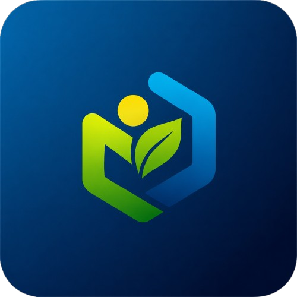

  
  <h1 align="center" style="font-family: Arial, sans-serif; border-bottom: none; margin-bottom: 0;">MBGBrain Enterprise Platform</h1>
  

    <strong>Sistem Cerdas Bertenaga AI untuk Orkestrasi Program Makan Bergizi Gratis (MBG)</strong>
  

  

    
    
    
    
  

 

<h2 style="font-family: Arial, sans-serif; color: #2A9D5C; border-bottom: 2px solid #2A9D5C; padding-bottom: 8px;">Pendahuluan</h2>

<strong>MBGBrain</strong> adalah sebuah platform manajemen pengadaan tingkat korporasi (Enterprise-grade Procurement Management System) yang dirancang secara khusus untuk memfasilitasi, mengawasi, dan mengotomatisasi rantai pasok (Supply Chain) Program Makan Bergizi Gratis (MBG). Platform ini bertindak sebagai jembatan strategis antara <strong>Satuan Pelayanan Pendidikan dan Gizi (SPPG)</strong> dengan ribuan UMKM serta pemasok lokal.

Dengan mengadopsi arsitektur <em>Single Page Application (SPA)</em> menggunakan Inertia.js dan Vue 3, serta keandalan pemrosesan backend Laravel 12, sistem ini menjamin pengalaman pengguna yang instan, efisien, dan tanpa hambatan (seamless).

 

<h2 style="font-family: Arial, sans-serif; color: #2A9D5C; border-bottom: 2px solid #2A9D5C; padding-bottom: 8px;">Spesifikasi Kebutuhan Sistem (System Requirements)</h2>

Sebelum memulai proses instalasi, pastikan infrastruktur server atau lingkungan pengembangan lokal Anda telah memenuhi spesifikasi perangkat lunak berikut ini secara absolut untuk menghindari kegagalan kompilasi dan eksekusi.

<table width="100%" style="border-collapse: collapse;">
  <thead>
    <tr style="background-color: #f3f4f6; text-align: left;">
      <th style="padding: 12px; border: 1px solid #e5e7eb;">Komponen Utama</th>
      <th style="padding: 12px; border: 1px solid #e5e7eb;">Versi Minimum</th>
      <th style="padding: 12px; border: 1px solid #e5e7eb;">Keterangan / Alternatif</th>
    </tr>
  </thead>
  <tbody>
    <tr>
      <td style="padding: 12px; border: 1px solid #e5e7eb;"><strong>PHP</strong></td>
      <td style="padding: 12px; border: 1px solid #e5e7eb;"><code>&gt;= 8.2</code></td>
      <td style="padding: 12px; border: 1px solid #e5e7eb;">Diwajibkan oleh Laravel 12.0. Disarankan PHP 8.3 untuk performa JIT terbaik.</td>
    </tr>
    <tr>
      <td style="padding: 12px; border: 1px solid #e5e7eb;"><strong>Node.js</strong></td>
      <td style="padding: 12px; border: 1px solid #e5e7eb;"><code>&gt;= 18.x</code></td>
      <td style="padding: 12px; border: 1px solid #e5e7eb;">Vite membutuhkan environment Node versi LTS terbaru (18 atau 20+).</td>
    </tr>
    <tr>
      <td style="padding: 12px; border: 1px solid #e5e7eb;"><strong>Composer</strong></td>
      <td style="padding: 12px; border: 1px solid #e5e7eb;"><code>&gt;= 2.2.x</code></td>
      <td style="padding: 12px; border: 1px solid #e5e7eb;">Pengelola paket dependensi untuk PHP.</td>
    </tr>
    <tr>
      <td style="padding: 12px; border: 1px solid #e5e7eb;"><strong>NPM / Yarn / pnpm</strong></td>
      <td style="padding: 12px; border: 1px solid #e5e7eb;"><code>Latest</code></td>
      <td style="padding: 12px; border: 1px solid #e5e7eb;">NPM versi 9.x atau di atasnya. Disarankan menggunakan Yarn untuk kecepatan instalasi.</td>
    </tr>
    <tr>
      <td style="padding: 12px; border: 1px solid #e5e7eb;"><strong>Database Management</strong></td>
      <td style="padding: 12px; border: 1px solid #e5e7eb;"><code>MySQL 8.0+ / PostgreSQL 14+</code></td>
      <td style="padding: 12px; border: 1px solid #e5e7eb;">Membutuhkan dukungan tipe data JSON dan fungsionalitas spasial.</td>
    </tr>
  </tbody>
</table>

 

<h3 style="font-family: Arial, sans-serif; color: #4b5563;">Ekstensi PHP yang Diwajibkan</h3>
<ul>
  <li><code>Ctype</code>, <code>cURL</code>, <code>DOM</code>, <code>Fileinfo</code>, <code>Filter</code></li>
  <li><code>Hash</code>, <code>Mbstring</code>, <code>OpenSSL</code>, <code>PCRE</code></li>
  <li><code>PDO</code> (beserta driver database spesifik seperti <code>pdo_mysql</code> atau <code>pdo_pgsql</code>)</li>
  <li><code>Session</code>, <code>Tokenizer</code>, <code>XML</code></li>
</ul>

 

<h2 style="font-family: Arial, sans-serif; color: #2A9D5C; border-bottom: 2px solid #2A9D5C; padding-bottom: 8px;">Arsitektur & Fitur Utama (Core Features)</h2>

  
  

    <h3 style="margin-top: 0; color: #111827;">Sistem Verifikasi Legalitas & Kepatuhan Terpusat</h3>
    

      Meliputi sistem unggah dokumen berlapis untuk para pemasok (Supplier). Pemasok diwajibkan menyertakan kelengkapan administratif seperti Nomor Induk Berusaha (NIB), Surat Izin Usaha Perdagangan (SIUP), dan Sertifikat Halal. Setiap dokumen akan diverifikasi oleh Admin Pusat melalui dasbor terintegrasi sebelum pemasok dapat berpartisipasi dalam lelang pengadaan MBG.
    

  

  

    <h3 style="margin-top: 0; color: #111827;">Algoritma Pencocokan Dinamis (Dynamic Matchmaking)</h3>
    

      Fitur andalan <em>(flagship feature)</em> yang menggunakan logika relasional untuk menghubungkan <strong>Permintaan Pengadaan</strong> yang dipublikasikan oleh SPPG dengan kapasitas operasional <strong>Pemasok</strong>. Algoritma ini mempertimbangkan batas harga maksimum, kuantitas penyediaan porsi, batas tenggat waktu, dan zona geografis untuk menghasilkan kandidat mitra paling optimal.
    

  

  

    <h3 style="margin-top: 0; color: #111827;">Pemetaan Geospasial (Geo-Spatial Mapping & Radius Validation)</h3>
    

      Mengintegrasikan pustaka Leaflet.js, sistem secara otomatis mengekstraksi titik koordinat Latitude dan Longitude. Hal ini membatasi penetapan dan partisipasi pelelangan secara spasial; memastikan bahwa logistik bahan pangan organik tidak mendegradasi kualitasnya akibat jarak pengiriman antar SPPG dan Dapur Umum Pemasok.
    

  

  

    <h3 style="margin-top: 0; color: #111827;">Infrastruktur Otorisasi Bebasis Peran (RBAC)</h3>
    

      Didukung oleh pustaka Spatie Permission, MBGBrain mengadopsi kontrol akses berlapis. Terdapat tiga aktor sistem utama dengan otonomi antarmuka yang terisolasi secara sempurna:
        
      <strong>1. Administrator Pusat:</strong> Kontrol penuh persetujuan dokumen dan pengawasan audit. 
      <strong>2. Pihak SPPG:</strong> Menerbitkan tender pengadaan makanan harian, serta konfirmasi kemitraan. 
      <strong>3. Pemasok (Supplier):</strong> Mengajukan permohonan suplai dan mengelola profil kapasitas pemenuhan dapur mereka.
    

  

 

<h2 style="font-family: Arial, sans-serif; color: #2A9D5C; border-bottom: 2px solid #2A9D5C; padding-bottom: 8px;">Panduan Instalasi & Deploy Komprehensif</h2>

Ikuti langkah-langkah prosedural di bawah ini untuk menginisiasi platform MBGBrain di lingkungan server lokal atau virtual machine Anda.

<h3>Fase 1: Inisialisasi Kode Sumber</h3>

Kloning repositori dengan izin kredensial Git yang sesuai.

<pre style="background-color: #1f2937; color: #f3f4f6; padding: 15px; border-radius: 6px; overflow-x: auto;">
<code>git clone https://github.com/Rafiqalha/masbahlil-ganteng.git
cd masbahlil-ganteng</code>
</pre>

<h3>Fase 2: Instalasi Dependensi Inti</h3>

Unduh pustaka-pustaka dependensi ekosistem PHP dan Node. Pastikan tidak ada bentrok versi (version conflicts) saat Composer mengunduh paket.

<pre style="background-color: #1f2937; color: #f3f4f6; padding: 15px; border-radius: 6px; overflow-x: auto;">
<code>composer install --optimize-autoloader --no-dev
npm install</code>
</pre>

<h3>Fase 3: Konfigurasi Lingkungan Server (Environment)</h3>

Salin berkas konfigurasi template ke profil aktif. Hasilkan kunci kriptografi (Application Key) untuk mengenkripsi <em>cookies</em> dan parameter sesi otentikasi.

<pre style="background-color: #1f2937; color: #f3f4f6; padding: 15px; border-radius: 6px; overflow-x: auto;">
<code>cp .env.example .env
php artisan key:generate</code>
</pre>

Buka berkas <code>.env</code> dengan editor teks (Nano, Vim, atau VS Code), dan sesuaikan konektivitas <em>Database</em> Anda:

<pre style="background-color: #1f2937; color: #f3f4f6; padding: 15px; border-radius: 6px; overflow-x: auto;">
<code>DB_CONNECTION=mysql
DB_HOST=127.0.0.1
DB_PORT=3306
DB_DATABASE=mbgbrain_production
DB_USERNAME=root
DB_PASSWORD=secret</code>
</pre>

<h3>Fase 4: Migrasi Basis Data & Pembenihan (Seeding)</h3>

Proyek ini mencakup struktur tabel spasial yang kompleks beserta Role dan Permission. Eksekusi migrasi untuk membentuk DDL (Data Definition Language) dan mengisi sistem dengan profil awal yang vital.

<pre style="background-color: #1f2937; color: #f3f4f6; padding: 15px; border-radius: 6px; overflow-x: auto;">
<code>php artisan migrate --seed</code>
</pre>

<em>Perhatian:</em> Parameter <code>--seed</code> akan secara otomatis memasukkan hirarki Spatie Roles dan kredensial uji coba untuk peran Admin, SPPG, dan Supplier.

<h3>Fase 5: Manajemen Media & Aset Statis</h3>

Buat tautan simbolis (symlink) untuk direktori penyimpanan lokal agar berkas-berkas sertifikasi Supplier dapat diakses secara publik pada perutean web.

<pre style="background-color: #1f2937; color: #f3f4f6; padding: 15px; border-radius: 6px; overflow-x: auto;">
<code>php artisan storage:link</code>
</pre>

<h3>Fase 6: Kompilasi Mesin Tampilan (Build Engine)</h3>

Bila mengkonfigurasi untuk sistem produksi (Production), jalankan kompilasi statis. Untuk lingkungan perancangan (Development), Anda dapat mengaktifkan modul Hot Module Replacement (HMR).

<pre style="background-color: #1f2937; color: #f3f4f6; padding: 15px; border-radius: 6px; overflow-x: auto;">
<code># Mode Produksi
npm run build

# Mode Pengembangan (Tinggalkan terminal terbuka)
npm run dev</code>
</pre>

<h3>Fase 7: Melayani Aplikasi via Protokol HTTP</h3>

Platform siap dieksekusi. Bila tidak menggunakan <em>web server</em> (Nginx/Apache), Anda dapat menggunakan server bawaan Laravel.

<pre style="background-color: #1f2937; color: #f3f4f6; padding: 15px; border-radius: 6px; overflow-x: auto;">
<code>php artisan serve</code>
</pre>

Akses platform melalui peramban di alamat: <strong>http://localhost:8000</strong>

 

<h2 style="font-family: Arial, sans-serif; color: #2A9D5C; border-bottom: 2px solid #2A9D5C; padding-bottom: 8px;">Kebijakan Lisensi & Legalitas</h2>

Platform <strong>MBGBrain</strong> dirancang secara tertutup (Proprietary Enterprise Software) untuk ekosistem pengadaan gizi terpadu. Penggunaan, modifikasi, atau pendistribusian ulang dari kode sumber ini tanpa persetujuan tertulis secara legal sangat dilarang. Segala kerentanan keamanan dan laporan eksploitasi harus dikoordinasikan secara eksklusif ke tim pengembangan utama.

  
Dikembangkan dan Dipelihara oleh Tim Inti MBGBrain

  
Hak Cipta © 2026 MBGBrain Indonesia. Seluruh Hak Dilindungi.

